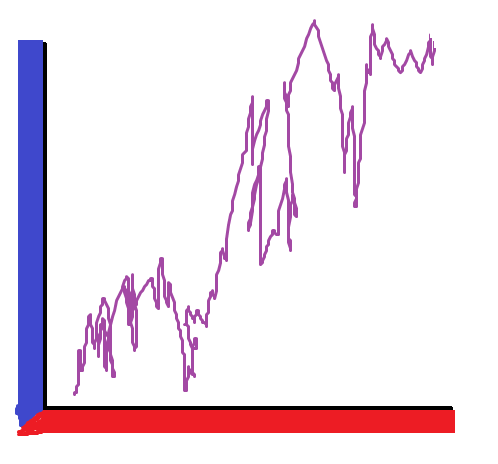

# Market Maker

<div align="center">

</div>

Market Maker is a suite of tools for managing threat simulation plans and test cases. Market Maker consists of three components: 1) Python library, 2) CLI scripts, and 3) extensions.

The [documentation directory](docs/) covers the core concepts and how to use the tool. A quickstart guide is also included in the docs here: [Quickstart](docs/Quickstart.md).

For an example of Market Maker generated content, see the SRA `indexes` repo: https://github.com/SecurityRiskAdvisors/indexes

## Installtion

```
pip install marketmaker
```
