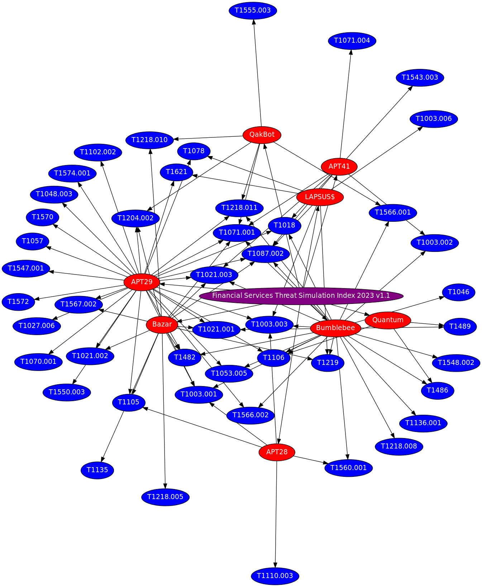

# Graphviz Extension

This extension generates a graph visualization for a Blueprint based on the top-level `group` mappings.
The graph displays the mapping between groups and technique IDs and is output as an SVG file.

Below is an example for the 2023 FS Index (as a PNG): 

## Additional requirements

To use this extension, you must have [Graphviz](https://graphviz.org/) installed and in your `PATH`

## Settings

|Arg|Variable|Description|Notes|
|---|---|---|---|
|--graphviz-svg-path|LIBMM_GRAPHVIZ_SVG_PATH|Path to SVG graph output file||
