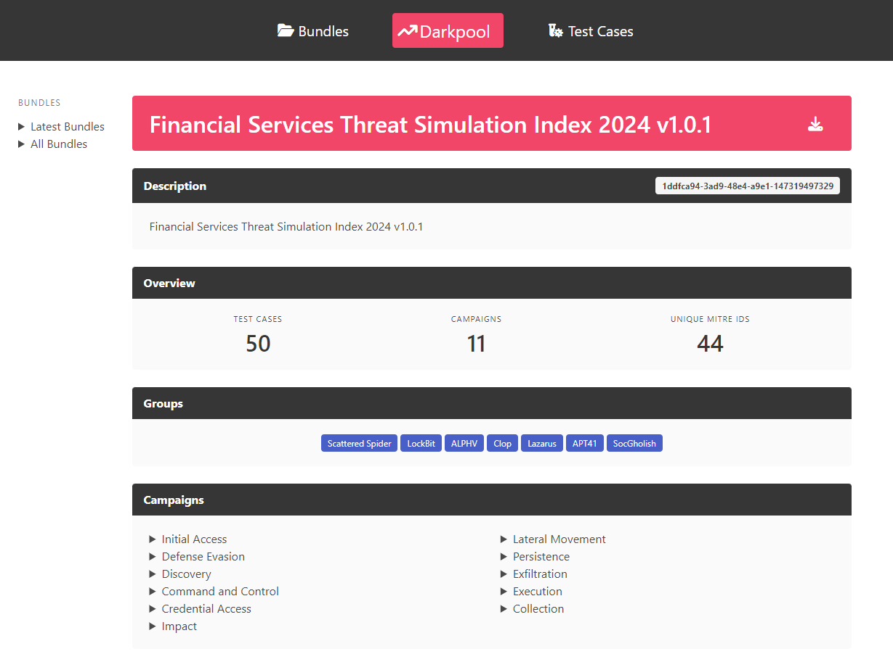
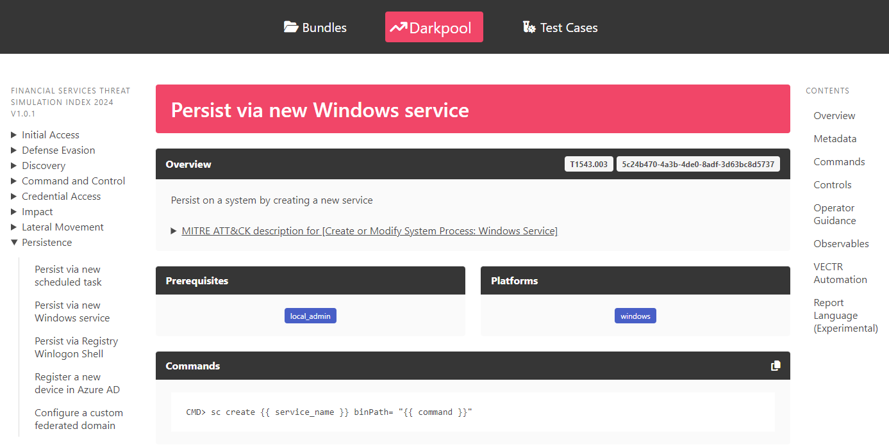

# MM Darkpool

Darkpool generates viewing interfaces for library contents.

The `mm-darkpool` script provides the following subcommands:

- `html` used for generating an HTML static site 

## Darkpool - HTML

### Usage

```
Usage: mm-darkpool html [OPTIONS]

Options:
  -t, --technique-paths TEXT      One or more paths to technique directories.
                                  Concatenate paths with a ':'. For example:
                                  /foo:/bar. Defaults to 'techniques/'
                                  [required]
  -b, --blueprint-paths TEXT      One or more paths to blueprint directories.
                                  Concatenate paths with a ':'. For example:
                                  /foo:/bar. Defaults to 'blueprints/'
                                  [required]
  -latest, --latest-json FILE     Path to latest.json file
  -outdir, --output-directory DIRECTORY
                                  Directory to output rendered HTML
  -n, --nav-directory DIRECTORY   MITRE ATT&CK Navigator bundle directory
                                  [required]
  -r, --recurse BOOLEAN           Recurse through Blueprints directory.
                                  Defaults to false
  --help                          Show this message and exit.
```

`--technique-paths` are the paths to one or more Variant Libraries. 
Refer to Market Maker documentation for more information on structure.

`--blueprint-paths` are the paths to one or more Blueprint directories.
By default, the application tries to load all YAML documents (`.yml`) in the root of each directory.
You can recurse into subdirectories by supplying the `--recurse` option.

`--latest-json` is the path to the `Latest` specification file (see below).

`--nav-directory` is the path to the MITRE ATT&CK Navigator UI bundle (see below).

`--output-directory` is the path to where the application will write the static site contents.

### Latest JSON 

The Latest specification is a JSON document that defines canonical names for bundles. 

A minimal Latest JSON should have the following structure:

```json
{
    "bundles": {
        "name": "file name"
    }
}
```

Example:

```json
{
    "bundles": {
        "fsindex": "fs_index_2024_v1.yml"
    }
}
```

Where `name` is the canonical name and `file name` is the Blueprint's file name (just the name and extension, no paths).

Blueprints included in the list will appear in the HTML UI under the `Latest` section in the bundle listing and sidebar.

### Navigator UI bundle

The HTML UI displays the Navigator layer for each Blueprint on that Blueprint's overview page. 
For this to work as expected, the application must be supplied the built UI bundle.
Refer to the documentation for building this bundle: https://github.com/mitre-attack/attack-navigator/?tab=readme-ov-file#install-and-run

*Note: You can use the included [Dockerfile](../../resources/navigator.dockerfile) to build a new UI bundle by
running it with a cloned Navigator repository mounted then extracting the generated tarball.*

### Linked Data

Linked data created by MM extenions is surfaced on individual test case and bundle pages. 
Section titles are based on the `display_name` and content formatting is based on the `data_format`.
`Markdown` formatted data will be rendered client-side using CommonMark.
`YAML` and `JSON` formatted data will be rendered client-side using Highlight.js.

### Third-party projects

Darkpool uses the following third-party UI projects client-side:

- [Bulma](https://bulma.io/) for CSS
- [Font Awesome](https://fontawesome.com/) for icons
- [marked](https://github.com/markedjs/marked) for Markdown rendering
- [Highlight.js](https://highlightjs.org/) for syntax highlighting
- [MiniSearch](https://github.com/lucaong/minisearch) for text search

All projects are loaded from public CDNs and use SRI for integrity checking.

### Example pages

Bundle

<div align="center">

</div>

Test case

<div align="center">

</div>

